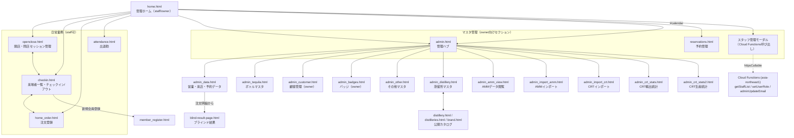
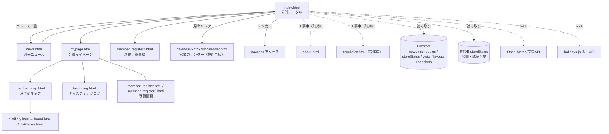

# ページフロー調査・処理監査（home.html / index.html 派生）

調査日: 2026-07-06　対象ブランチ: `claude/admin-workflow-audit-8ispma`

## 1. 管理業務フロー（home.html 起点）

## 2. ポータルフロー（index.html 起点）

### 直リンク専用（どこからもリンクされていない）ページ
`receipt.html` / `index2.html` / `admin_map.html` / `admin_cocktail.html` /
`admin_tree.html` / `admin_distillerytree.html` / `member_collection.html` /
`migrate_order_ids.html` / `admin_import_crt_coords.html` / `tools/migrate_location_uppercase.html`
（レガシー・移行ツール・実験ページと推定。削除は今回行っていない）

## 3. 発見した問題と対応

### 修正済み（本ブランチ）

| # | ファイル | 問題 | 修正 |
|---|---|---|---|
| 1 | home.html | Cloud Functions のリージョンが `us-central1` 指定。実際の関数は全て `asia-northeast1` にデプロイされており、スタッフ管理（一覧・役割変更・削除・追加）が**全て動作しない** | `asia-northeast1` に修正 |
| 2 | home.html | スタッフ追加が存在しない関数 `adminAuthOperation` を呼んでいた。さらに「新規作成した Auth アカウント」に対し「本会員（active）であること」を要求するため、成立し得ないフロー（失敗時は孤児 Auth アカウントが残る設計） | 既存本会員をメールアドレスで検索し、`setUserRole` で役割を付与する方式に変更。パスワード欄を撤去 |
| 3 | home.html | ログイン済みなら誰でも（会員アカウントでも）日常業務タイルが見えた。role 判定も members を email 検索する独自方式で auth-role.js と不整合 | 他の日常業務ページと同じ `AuthRole.requireStaff` ガードに統一 |
| 4 | admin.html | ログインのみで管理ハブに入れた（role チェックなし） | `AuthRole.requireStaff` を導入（firestore-compat / auth-role.js を追加読み込み） |
| 5 | reservations.html | ログインのみで予約（氏名・連絡先等）を閲覧・編集できた | `AuthRole.requireStaff` を導入 |
| 6 | admin_data.html | ログインのみで営業・来店・注文データを編集できた | `AuthRole.requireStaff` を導入 |
| 7 | admin_distillery.html | auth-role.js を読み込みながらガードを外していた（ログインのみ） | `AuthRole.requireStaff` を導入 |
| 8 | index.html | 予約アイコン機能が無効化済み（`idxMakeRsvIcon` は空を返す）なのに、公開ページで `reservations` 全件（氏名・メモ等の個人情報）を全訪問者のブラウザにダウンロードしていた | 取得を停止（`Promise.resolve()` に置換） |
| 9 | index.html | 営業カレンダーリンクが `https://www.tequiladojo.com/...` の絶対URL固定で、プレビュー/ステージング環境で本番に飛ぶ | 相対パス `/calendar/...` に変更 |

### 要検討（今回は変更していない・運用影響が大きいため報告のみ）

1. **firestore.rules が実質ノーガード**（最重要）
   - 現状: 全コレクション `read: if true`（公開読み取り）、書き込みは「匿名以外の認証ユーザー」なら誰でも可。
   - 会員は `member_register2.html` で誰でもメール/パスワード（仮想ドメイン `@tequiladojo.member`）アカウントを自己作成できるため、**任意の第三者が会員登録するだけで全コレクションへの書き込み権限を得られる**（members・visits・orders・schedules 等の改竄が可能）。
   - 読み取りも公開のため、members / visits / reservations 等の個人情報が未認証で読める。
   - 対応案: Custom Claims（`request.auth.token.role in ['owner','staff']`）ベースでコレクション別に許可を設計する。ただし、既存スタッフアカウントに role claim が確実に付与されていること（`syncAllRoles` 実行済み）を確認してから段階的に適用しないと業務が止まるため、今回の自動修正は見送り。
2. **admin_import_amm / admin_import_crt / admin_amm_view / admin_crt_stats(2)** は未ログインでも開ける（匿名サインインで読み取り、書き込みはルールで拒否される想定）。CRT統計はGitHub上の公開データが主だが、`admin_` 系ページとしてはガード追加を推奨。
3. **カレンダー静的ファイルが 202608 まで**しか無い。2026年9月以降、index.html のカレンダーリンクが404になる。月次生成の運用（または自動生成）が必要。
4. **news のタイトル/本文が innerHTML 直挿入**（index.html / news.html）。入力者は管理者のみだが、エスケープ推奨。
5. **レガシー/孤児ページ**（上記リスト）は導線が無い。不要なら削除、必要なら admin.html からリンクを整理することを推奨。
6. home.html の「営業カレンダー」タイルは `admin.html#calendar` に飛ぶが、admin.html 側にカレンダー専用アンカー処理は無く単にハブが開くのみ（実害なし・導線として紛らわしい）。
